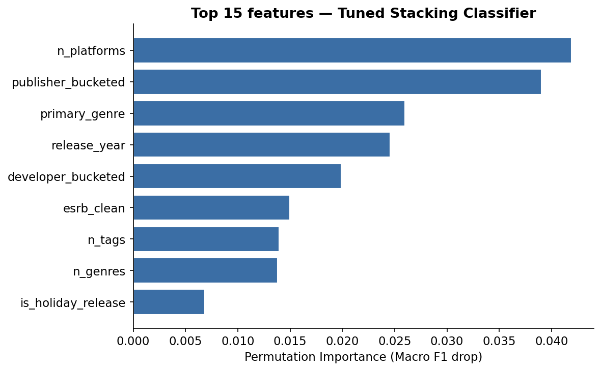
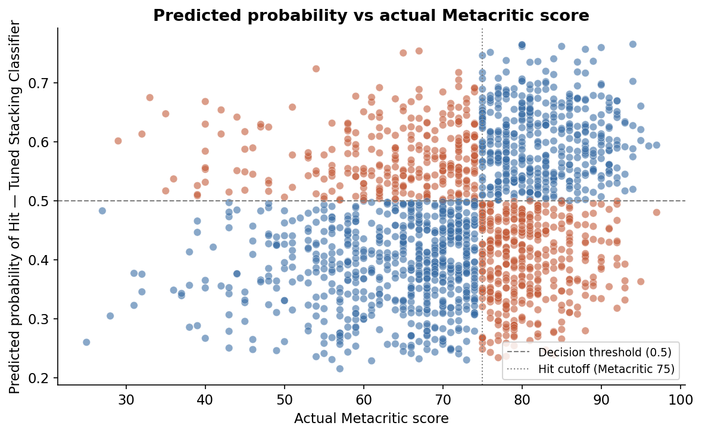

# Game Success Classifier

Can a video game's own release-time data predict whether critics will love it? This project trains and compares machine learning models to predict whether a game will be **critically acclaimed** (Metacritic score ≥ 75) using only characteristics genuinely known at or before release — genre, platform count, developer, publisher, ESRB rating, tag diversity, and release timing.

Built as Mini Project 3 for the IOD Data Science & AI course.

## Business Question

The video game industry earns over $180B a year, with thousands of titles released annually. A strong Metacritic score drives storefront visibility and can determine a studio's commercial fate. So: **can we predict critical success before or at release, using only pre-release signals** — without leaking the answer through the score itself?

A game is labelled **Hit** (Metacritic ≥ 75) or **Not Hit** (< 75).

## Data

- **Source:** [RAWG Video Games Database API](https://rawg.io/apidocs), collected via the custom script in `src/collect_rawg_data.py`
- **Size:** 7,141 games after cleaning
- **Coverage:** 1980–2024 (skews toward older, already-reviewed titles — RAWG's coverage of 2022+ releases is thin)
- **Class balance:** 47.2% Hit / 52.8% Not Hit — close enough to balanced that no resampling was needed

The raw data was genuinely messy: genres, platforms, and tags arrived as pipe-separated strings in a single column (e.g. `"Action|RPG|Adventure"`), and ~33% of games had no ESRB rating recorded. All of this is cleaned and engineered into model-ready features in the notebook (Section 2).

**A note on data leakage, and why the results below look modest:** an earlier version of this project also used `rating_count` and `playtime` as features. Both are RAWG metrics that accumulate *after* a game releases — for an older title, `rating_count` can reflect decades of accumulated community engagement, not anything knowable at launch. `rating_count` alone dominated every other feature by more than 5×, which was the tell that it was leakage rather than a genuine signal. Both features were removed and the model retrained on features that are actually available at or before release: `metacritic` and community `rating` were already excluded for the same reason (they're near-restatements of the target). See Section 4 of the notebook for the full explanation.

This project builds on an earlier one (MP02), which predicted the raw Metacritic score directly with linear regression. Here the problem is reframed as classification — predicting Hit / Not Hit rather than a specific score.

## Approach

1. **Clean & engineer features** — parse pipe-separated columns, flag holiday releases, fill missing ESRB as "Not Rated", bucket developer/publisher to the top 25 most frequent studios (rest grouped as "Other")
2. **Feature selection** — exclude leakage-risk columns (`metacritic`, `rating`, `rating_count`, `playtime`); keep only signals genuinely available at or before release, including developer and publisher (public knowledge from the moment a game is announced, so not leakage)
3. **Train 4 models** — a majority-class baseline (sanity check), Logistic Regression, Random Forest, and a Stacking ensemble (Logistic Regression + Random Forest combined via a meta-learner)
4. **Evaluate** — Macro F1 (primary metric, since classes are only near-balanced) and ROC-AUC (secondary)
5. **Tune** — GridSearchCV with stratified 3-fold cross-validation on the best-performing model
6. **Explain** — feature importance (native Gini importance for tree-based champions, with a permutation-importance fallback for ensembles like the Stacking Classifier that don't expose one)
7. **Sanity-check** — compare predictions directly against actual Metacritic scores to see where the model succeeds and where it fails

## Results

| Model | Macro F1 | ROC-AUC |
|---|---|---|
| Baseline (majority class) | 0.345 | 0.500 |
| Logistic Regression | 0.550 | 0.573 |
| Random Forest | 0.600 | 0.639 |
| **Stacking Classifier (best, tuned)** | **0.607** | **0.640** |

All four real models beat the baseline, confirming there's genuine — if modest — predictive signal in features that are truly available before a game releases. Tuning found no further improvement over the default configuration this time — the default Stacking Classifier already matched its own best cross-validated score.

**These numbers are a step up from an earlier version of this project (Macro F1 0.570, ROC-AUC 0.615), and the reason is a real bug fix, not a leakage reintroduction.** The original data collection script requested developer and publisher from the wrong RAWG API endpoint, so those fields always came back empty. Once fixed and the fields properly collected, adding `developer` and `publisher` (bucketed to the 25 most common studios) lifted both metrics. Unlike `rating_count` and `playtime`, developer and publisher are public knowledge the moment a game is announced — including them is a genuine pre-release signal, not leakage.

**These numbers are still a lot lower than the very first version of this project reported (Macro F1 0.690, ROC-AUC 0.747), and that's intentional.** That earlier result relied on `rating_count`, which turned out to be data leakage (see the note under **Data** above). Once it — and the similarly-leaky `playtime` — were removed, honest performance dropped substantially before developer/publisher partially recovered some of that gap.

**What actually drives the (smaller, honest) signal:** the champion is now a Stacking Classifier, so feature importance is read via permutation importance rather than a native attribute. `n_platforms` and the new `publisher_bucketed` feature rank highest, with `primary_genre` and `release_year` close behind — still no single feature dominates the way `rating_count` used to. Interestingly, `publisher_bucketed` ranks high in importance but wasn't statistically significant in the logistic regression test, while `developer_bucketed` was significant but ranks lower in importance — a reminder that "does this feature matter statistically" and "how much does the trained model actually lean on it" are different questions.



**Predictions vs actual scores:** comparing the model's predictions directly against real Metacritic scores shows its mistakes cluster right at the 75-point cutoff — games that scored exactly 75 are the hardest to call correctly, since a game scoring 73 and one scoring 77 look nearly identical on every feature used here. This is the expected failure mode of a hard binary threshold on a continuous, noisy score, and it's a structural limit that more features alone won't fully fix.



## Limitations

- Dataset skews toward older, already-reviewed games — the API returned limited data for 2022 onward
- Metacritic itself isn't a perfect measure of quality — a game can score below 75 and still be deeply valued by its audience
- Model performance is modest (Macro F1 0.61) — a real improvement over the leakage-free baseline, but still far from a strong predictor. Errors concentrate near the 75-point cutoff, a structural limit of a hard binary label on a continuous score
- Game descriptions were collected alongside developer/publisher but aren't used as features yet — a natural next step (see below)

## Future Improvements

- Recollect a larger, date-balanced sample so recent releases aren't underrepresented
- Add NLP features from game descriptions, now collected but not yet used
- Look for legitimate pre-release engagement signals (wishlist counts, trailer views, pre-order numbers) as a non-leaky stand-in for the "buzz" signal `rating_count` was incorrectly capturing
- Explore multi-class prediction (Not Hit / Average / Good / Great) so the model isn't forced into a hard call right at the 75-point boundary
- Package the model behind a simple app — pick genre, platform, developer, publisher, and ESRB rating, get a prediction

## Repo Structure

```
game-success-classifier/
├── README.md
├── requirements.txt
├── src/
│   └── collect_rawg_data.py          # pulls data from the RAWG API
├── notebooks/
│   └── MP03_Game_Success_Classifier.ipynb   # full analysis, start to finish
├── data/
│   └── rawg_games.csv                # collected dataset (git-ignored)
└── outputs/
    └── *.png                          # charts saved out by the notebook
```

## Running This Yourself

```bash
git clone https://github.com/brighthikaru/game-success-classifier.git
cd game-success-classifier
pip install -r requirements.txt
jupyter notebook notebooks/MP03_Game_Success_Classifier.ipynb
```

To recollect fresh data instead of using the included CSV, set a `RAWG_API_KEY` in a local `.env` file and run `python src/collect_rawg_data.py`.

## Data Attribution

Data sourced from the [RAWG Video Games Database API](https://rawg.io) — used under its free tier with attribution.
